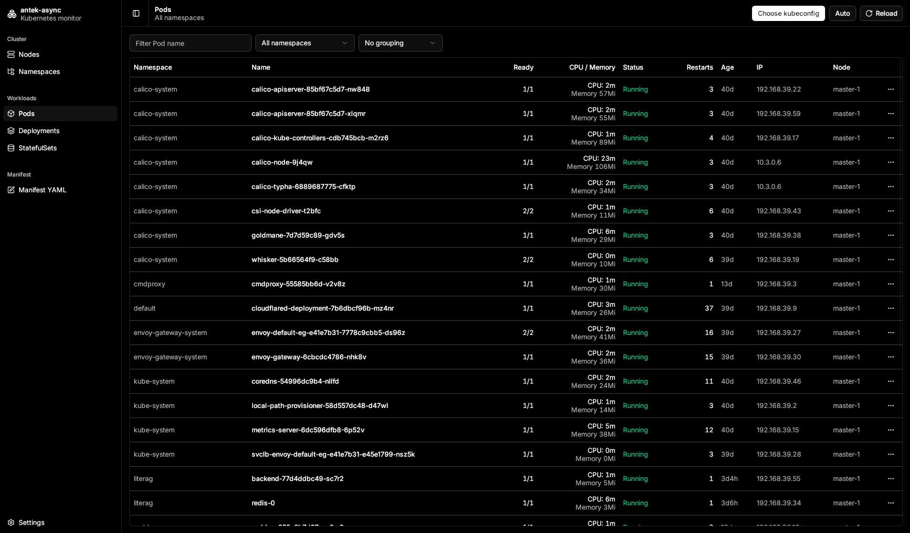

# antek-async

K3s desktop client for Linux and Windows. Reads configuration from kubeconfig and executes Kubernetes API calls the way kubectl does. This project was started to make it easier to monitor Kubernetes clusters, without needing to SSH into the server or run kubectl locally.

Besides monitoring, the Editor menu applies one YAML manifest to the active cluster with server-side apply, the same way `kubectl apply` does.

