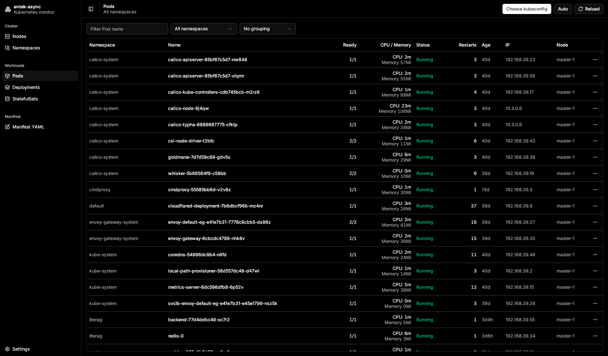

# antek-async

K3s desktop client for Linux and Windows. Reads configuration from kubeconfig and executes Kubernetes API calls the way kubectl does, no Agent inside the cluster, no custom-resource definitions. This project was started to make it easier to monitor Kubernetes clusters, without needing to SSH into the server or run kubectl locally.

Besides monitoring, the Manifest YAML menu applies one YAML manifest to the active cluster with server-side apply, the same way `kubectl apply` does. The Namespaces menu can also delete a namespace, but only after the word `delete` and the namespace name are typed back into the confirmation dialog.

The Networking menu carries a Gateway API submenu with GatewayClass, Gateway, HTTPRoute and GRPCRoute. Those four are custom resources rather than built-in kinds, so they list when the Gateway API CRDs are installed and each page says so plainly when they are not.

The Pods and Nodes tables show CPU and memory in a single column, read from metrics-server every five seconds while that menu is open. The values are formatted the way `kubectl top` prints them, and a cluster without the metrics API shows `-` there while the rest of the list works as usual.

Each Pod row also carries an actions menu: **View YAML** opens a read-only YAML view of the pod, **Terminal** opens an interactive shell in one of its containers, and **View Log** streams the pod's log into a read-only terminal viewer, starting from the last 200 lines of the first container and then following it live.



## Building

`wails build` writes the binary to `build/bin/`: `antek-async` on Linux, `antek-async.exe` on
Windows. It installs the frontend dependencies, builds the frontend, regenerates the bindings and
compiles the Go code, so Go 1.25, Node 22 and the Wails CLI are all it needs.

```bash
go install github.com/wailsapp/wails/v2/cmd/wails@v2.16.0   # once, installs the CLI
wails build                                                 # -> build/bin/antek-async
```

The build is native, so each platform is built on itself:

- **Linux** needs the GTK 3 and WebKitGTK headers. Ubuntu 24.04 ships webkit2gtk-4.1 only and no
  4.0, so it also needs the tag that matches: install `libgtk-3-dev libwebkit2gtk-4.1-dev`, then
  run `wails build -tags webkit2_41`.
- **Windows** needs no extra packages. The WebView2 runtime is a run-time requirement rather than
  a build one, and the default build carries its bootstrapper.

`build/` is created on the first build from the Wails defaults, app icon and Windows manifest
included, so those files only need committing once they are customised.

Both targets are built on GitHub Actions, one runner per platform, and attached to the release
when a `v*` tag is pushed. The workflow is `.github/workflows/build.yml`.
